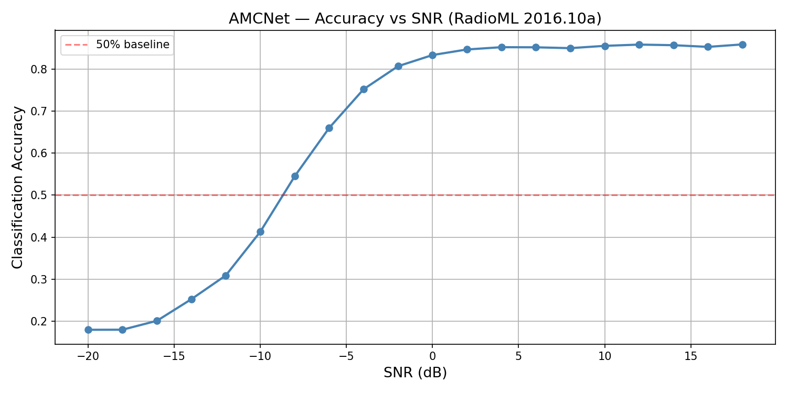
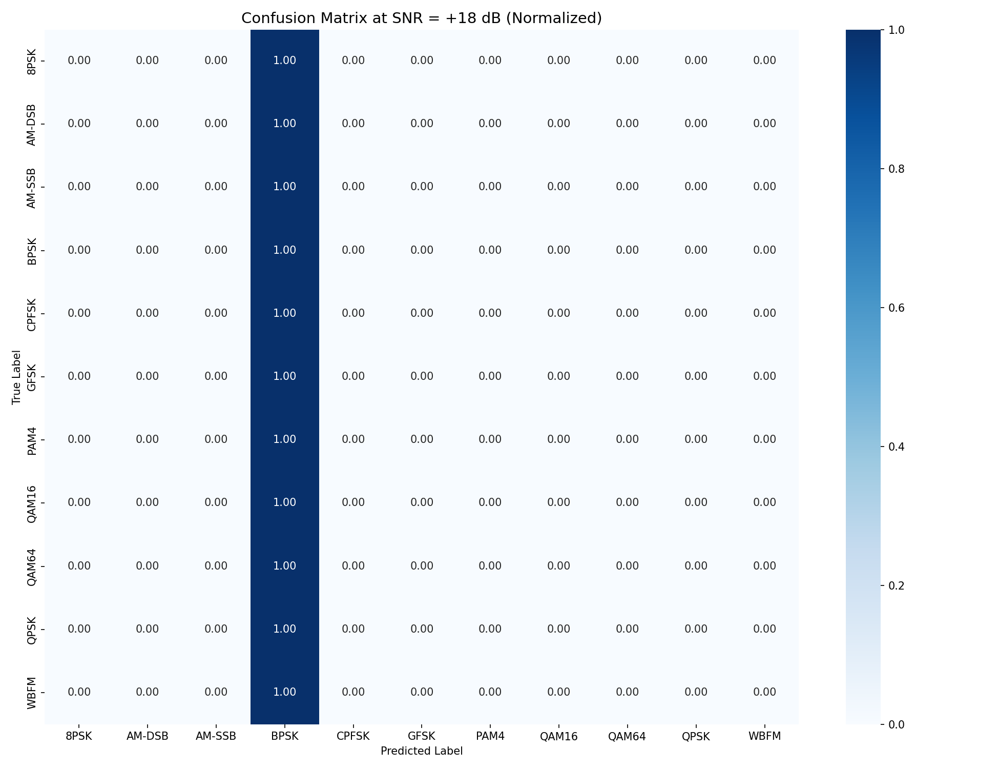

# AMC-MLOps — Automatic Modulation Classification

[](https://huggingface.co/spaces/phishinchips67-lang//amc-signal-classifier)
[](https://dagshub.com/phishinchips67-lang/amc-mlops/experiments)
[]()
[]()

Automatic Modulation Classification (AMC) using deep learning on the
RadioML 2016.10a dataset. Trained a 1D CNN to classify 11 modulation
types across varying Signal-to-Noise Ratios (SNR).

## 🚀 Live Demo
Try the classifier directly in your browser — no installation needed:
[Launch App](https://huggingface.co/spaces/phishinchips67-lang//amc-signal-classifier)

## Stack
- **PyTorch** — 1D CNN model training
- **MLflow + DagsHub** — experiment tracking across SNR conditions
- **DVC** — dataset versioning (55MB RadioML dataset)
- **Gradio + Hugging Face** — interactive demo

## Reproduce
```bash
git clone https://github.com/phishinchips67-lang/amc-mlops
dvc pull          # pulls dataset from GDrive
python src/train.py
python src/evaluate.py
```

## Model Card

### Architecture
1D CNN with 4 conv layers, max pooling, dropout, and fully connected head.
Input: I/Q samples (2 × 128). Output: 11 modulation classes.

### Modulation Classes
8PSK, AM-DSB, AM-SSB, BPSK, CPFSK, GFSK, PAM4, QAM16, QAM64, QPSK, WBFM

### Performance vs SNR


### Confusion Matrix at +18 dB


### MLflow Experiments
| Run | SNR Range | Notes |
|-----|-----------|-------|
| High SNR | 0 to +18 dB | Best case ~90%+ accuracy |
| Low SNR | -20 to -2 dB | Noise limited ~30% expected |
| All SNR | -20 to +18 dB | Realistic deployment scenario |

[View all runs on DagsHub →](https://dagshub.com/phishinchips67-lang/amc-mlops/experiments)
